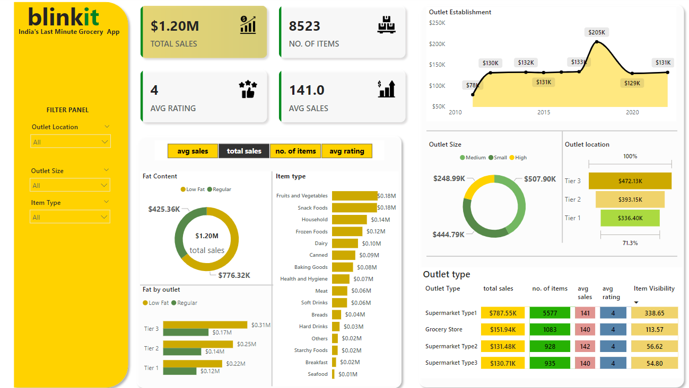

# BlinkIT Grocery Data Analysis and Insights

## Project Background
This project focuses on analyzing grocery sales data for **BlinkIT**, a last-minute grocery app in India. The analysis aims to provide actionable insights into sales, item categories, outlet performance, and customer preferences. Leveraging **Power BI**, the project visualizes key metrics like total sales, average sales, and outlet-level performance. These insights are critical for decision-making in retail operations, marketing strategies, and inventory management.

## Insights and Recommendations
Insights and recommendations are provided across the following key areas:

1. **Sales Trends**
2. **Outlet Performance**
3. **Item Categories**
4. **Customer Preferences**

## Data Structure & Initial Checks
The data includes the following key fields:

- **Outlet Information**: Size, location, establishment year, and type.
- **Item Details**: Type, fat content, visibility, and sales figures.
- **Performance Metrics**: Total sales, number of items sold, and average sales.

The dataset was pre-processed to ensure data quality and consistency before visualization.

## Executive Summary
Key insights from the analysis include:
- **Outlet Size**: Medium-sized outlets generated the highest sales ($507.90K).
- **Outlet Location**: Tier 3 locations outperformed others, contributing $472.13K in sales.
- **Item Categories**: Fruits, vegetables, and snack foods were the top-selling categories, contributing $0.36M in total.
- **Fat Content**: Items with regular fat content accounted for 65% of total sales.

These insights provide a comprehensive understanding of the factors driving sales and customer preferences, enabling targeted marketing and operational improvements.

## Insights Deep Dive

### **Sales Trends**
- **Insight 1**: Sales peaked in **2015** at $205K, followed by a steady decline until 2020.
- **Insight 2**: Total sales reached $1.20M across all outlets and item types.

### **Outlet Performance**
- **Insight 1**: **Medium-sized outlets** dominated sales, generating $507.90K.
- **Insight 2**: **Tier 3 locations** accounted for 39% of total sales, the highest among all tiers.

### **Item Categories**
- **Insight 1**: Fruits and vegetables, snack foods, and household items were the most popular categories, each contributing $0.18M in sales.
- **Insight 2**: Low-fat items had significant traction, accounting for $425.36K in sales.

### **Customer Preferences**
- **Insight 1**: Outlets classified as **Supermarket Type1** contributed $787.55K to total sales.
- **Insight 2**: The average sales per item were highest in **Supermarket Type1** outlets.

## Recommendations
Based on the analysis, the following actions are recommended:
- **Expand medium-sized outlets** in Tier 3 locations to capitalize on their high performance.
- Focus on **promoting fruits, vegetables, and snack foods** to sustain high sales in these categories.
- Introduce marketing campaigns highlighting **low-fat items**, which account for a significant portion of sales.
- Improve visibility and marketing efforts for underperforming item categories like **seafood and breakfast items**.

## Assumptions and Caveats
1. Missing data was imputed where possible or excluded if deemed unreliable.
2. Sales data was assumed to be complete and representative of actual transactions.
3. Categories like **outlet size** and **item visibility** were segmented into predefined brackets for analysis.

## Metrics
The following key metrics were calculated:
- **Total Sales**: $1.20M
- **Number of Items Sold**: 8,523
- **Average Sales Per Item**: $141
- **Average Rating**: 4

## Steps for Implementation

### Step 1: Data Preprocessing
- Load and clean data in **Excel** to address missing values and inconsistencies.
- Validate key fields like sales, outlet size, and item categories.

### Step 2: Data Transformation
- Segment fields into meaningful groups (e.g., fat content, outlet size, item type).
- Create calculated columns for metrics like average sales and item visibility.

### Step 3: Power BI Dashboard
- Build interactive dashboards to visualize sales trends, outlet performance, and customer preferences.
- Use slicers for dynamic filtering by outlet size, location, and item type.

## Tools & Technologies
- **Power BI**: For creating interactive dashboards.
- **Excel**: For data preprocessing and transformation.

---

Feel free to adapt this project for your business needs. If you have any questions, explore the repository or contact us for additional details.
